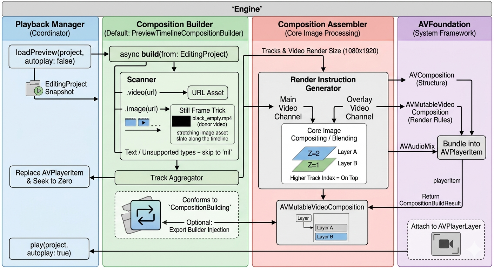

## 🎬 VideoEditor (R&D Project)

VideoEditor is an **R&D / educational** iOS video editing app experiment targeting iOS 16.0+. The goal is to explore modern Swift, UIKit, Concurrency and media technologies (e.g. AVFoundation, CoreImage, CoreVideo) with a **sustainable and testable** architecture. 

---

## Project vision
- **Simplify AVKit Usage**: While compositing videos (AVVideoTrackComposition)
- **1**: Make stil images handled like a video or audio track.
- **2**: Simplify overlay media item usages with tracks.
- **3**: Fix video stoping when audio shorter than video track.
- **4**: Use core image downsampling for each frame to avoid memory pressures.
- **Modularity**: Clear separation of UI, Domain, and Data layers.
- **Testability**: Dependencies are injected via DI.
- **Simplicity**: KISS principle; avoid unnecessary abstraction.
- **UIKit-first**: Screens are built with programmatic UIKit + Auto Layout.

---

## Requirements

- **Xcode**: 26.3
- **iOS Deployment Target**: 16.0+
- **Language**: Swift 5.5+

---

## Preview engine: from `EditingProject` to playback

The editor preview is **not** a raw file player. It rebuilds an **AVFoundation composition** from the current project state whenever you load or press play.

### Pipeline overview

This diagram shows how **`EditorPlaybackManager`** coordinates **`loadPreview`** / **`play`**, how **`PreviewTimelineCompositionBuilder`** scans tracks and aggregates sources, and how the assembler + AVFoundation produce an **`AVPlayerItem`** for the preview layer.

### Domain contract

- **`EditingProject`** (`Domain/Models/`): The serializable project — tracks, clips, timeline/source time ranges, export settings. Track order implies **z-order** (later tracks draw on top).
- **`CompositionBuilding`** (`Domain/Protocols/CompositionBuilding.swift`): `build(from: EditingProject)` → **`CompositionBuildResult`** (`AVPlayerItem` + `AVComposition` + `AVVideoComposition`, plus optional overlay layers).

### Default engine (`Engine/`)

**`PreviewTimelineCompositionBuilder`** implements `CompositionBuilding`:

1. Computes project duration and a fixed preview **render size** (1080×1920).
2. Walks **video** and **overlay** tracks and turns each supported clip into internal preview sources (file video maps source range → timeline; still images use a tiny bundled **donor** video so AVFoundation has real samples).
3. **`PreviewCompositionAssembler`** (`PreviewVideoCompositionCore.swift`) builds an **`AVMutableComposition`** and a custom **`AVMutableVideoComposition`** (Core Image–based compositing for stacking, effects, transitions).
4. **Audio** clips are inserted on separate composition audio tracks; tracks are **padded** to the full project length with empty ranges where needed.
5. Wraps the composition in **`AVPlayerItem`**, attaches `videoComposition` / `audioMix` when present, and returns the result.

Other asset types (e.g. some identifiers) may be skipped until implemented — the builder only includes what it can turn into composition segments.

### UI wiring (`EditorPlaybackManager` + editor screen)

- **`EditorViewModel.projectSnapshot()`** produces an **`EditingProject`** that reflects the current timeline (including edits). Playback always uses this snapshot, not a stale copy.
- **`EditorPlaybackManager`** holds a **`CompositionBuilding`** instance (default: `PreviewTimelineCompositionBuilder`), an **`AVPlayer`**, and an **`AVPlayerLayer`** placed inside **`EditorRenderView`**’s canvas.
- **First appearance:** `EditorViewController` calls **`loadPreview`**: build composition, attach/replace the player item, **pause at time zero** (thumbnail-style first frame).
- **Toolbar play:** **`play`** runs **`build` again** with the latest snapshot, then **`player.play()`**. Pause only pauses — no rebuild.

Playhead updates come from a periodic time observer on the player; reaching the end triggers pause and resets the toolbar play state.

---

## Roadmap

- Media import (Photos / Videos / Audio) ✅
- Timeline + trim media items ✅
- Create Composition builder (accepts image & video & audio and converts them into composition & playerItem) ✅
- Composition builder optimizations (working on it)
- EditorTimelineView optimizations for play, fast scrub debounce etc. 
- Add transition between media items ✅
- Add overlay media items support like sticker and text (working on it)
- Add applying effects to media items (like glitch etc)
- Add applying core image & custom filter to media items
- HDR support
- Higher render size support
- Export pipeline (presets/bitrate) ✅
- Add export file type (.mp4, .mov) ✅

> **Production notice:** This project is currently a “playground” and should not be considered production-ready.
